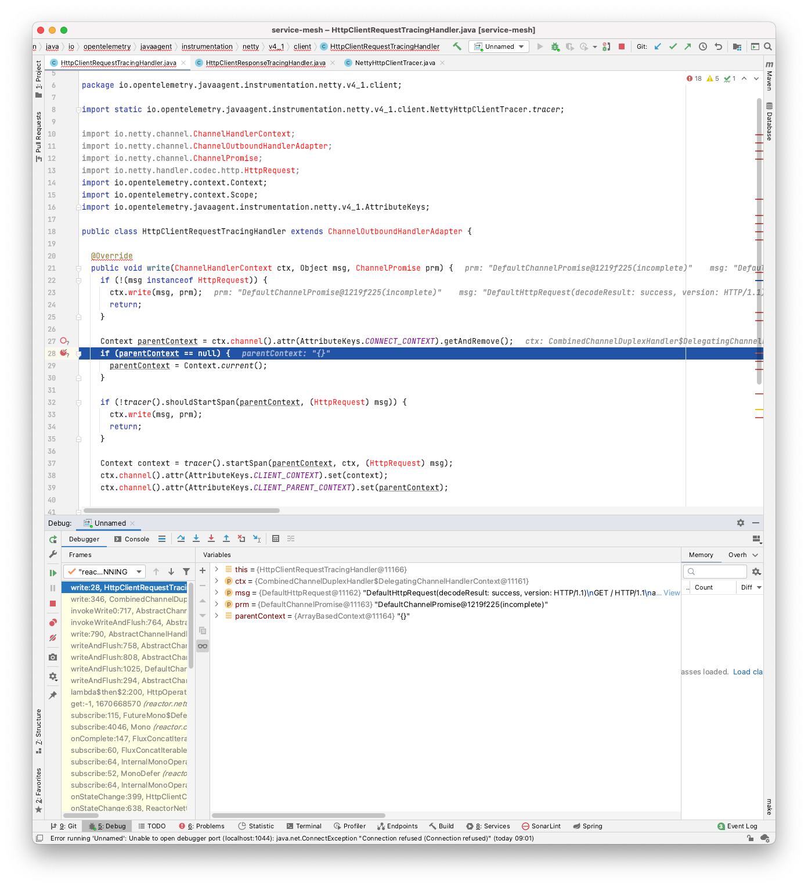
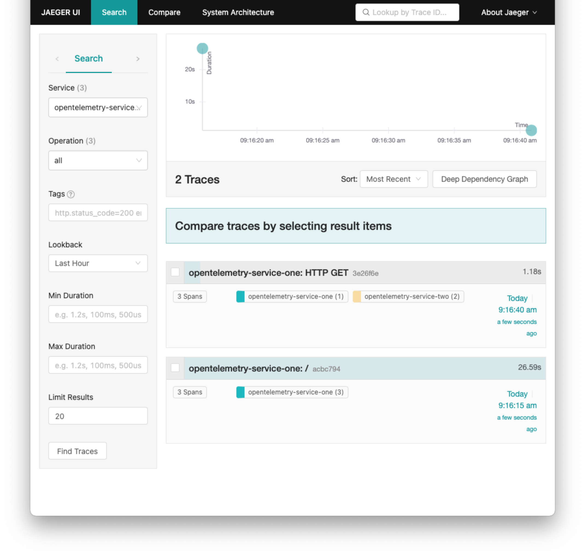

# WebClient broken spans

Using 2 Spring Boot WebMVC - webservices, I experienced that some spans generated by OpenTelemetry weren't properly connected.
In this setup service 1 makes an HTTP request to service 2 using Spring's WebClient.

So far, I could only reproduce this issue when the applications were deployed to kubernetes.
I've tried it on 3 different kubernetes instances.
- k3s:
  - kernel: `Linux debtest 5.4.0-65-generic #73-Ubuntu SMP Mon Jan 18 17:25:17 UTC 2021 x86_64 GNU/Linux`
  - k8s server version: `v1.20.0+k3s2 (Server Version: version.Info{Major:"1", Minor:"20", GitVersion:"v1.20.2", GitCommit:"faecb196815e248d3ecfb03c680a4507229c2a56", GitTreeState:"clean", BuildDate:"2021-01-13T13:20:00Z", GoVersion:"go1.15.5", Compiler:"gc", Platform:"linux/amd64"})`
- Minikube on MacOS:
  - kernel: `Linux debtest 4.19.121-linuxkit #1 SMP Tue Dec 1 17:50:32 UTC 2020 x86_64 GNU/Linux`
  - k8s server version: `v1.20.0+k3s2 (Server Version: version.Info{Major:"1", Minor:"20", GitVersion:"v1.20.2", GitCommit:"faecb196815e248d3ecfb03c680a4507229c2a56", GitTreeState:"clean", BuildDate:"2021-01-13T13:20:00Z", GoVersion:"go1.15.5", Compiler:"gc", Platform:"linux/amd64"})`
- custom kubernetes installation
  - kernel: `Linux 5.4.87-flatcar #1 SMP Fri Jan 8 19:54:07 -00 2021 x86_64 x86_64 x86_64 GNU/Linux`
  - k8s server version: `v1.18.14 (Server Version: version.Info{Major:"1", Minor:"18", GitVersion:"v1.18.14", GitCommit:"89182bdd065fbcaffefec691908a739d161efc03", GitTreeState:"clean", BuildDate:"2020-12-18T12:02:35Z", GoVersion:"go1.13.15", Compiler:"gc", Platform:"linux/amd64"})`

I encountered the same symptoms on all 3 platforms.
Oddly enough, a docker-compose setup didn't show this issue.


| **K3s**                                                       | **Minikube**                                                            | **docker-compose**                                                    |
| ------------------------------------------------------------- | ----------------------------------------------------------------------- | --------------------------------------------------------------------- |
| empty, but non-null parent context                            | empty, but non-null parent context                                      | properly populated parent context                                     |
|  |  |  |
|          |                |  |

## Steps to reproduce

1. Deploy to Kubernetes
2. Call web service 1 (HTTP GET /)
  - Check jaeger-ui for traces and see broken trace
3. Make another call to web service 1 within a short period of time
  - Check jaeger-ui again, see new trace with 5 spans instead of the three spans seen before

Netty seems to also create a new channel every 100 requests. Broken traces can then also be encountered.

```
[opentelemetry.auto.trace 2021-02-02 12:45:36:047 +0000] [http-nio-8080-exec-2] DEBUG io.opentelemetry.javaagent.instrumentation.api.concurrent.RunnableWrapper - Wrapping runnable task reactor.netty.transport.TransportConnector$MonoChannelPromise$$Lambda$1167/0x0000000800a14040@7af407fd
[opentelemetry.auto.trace 2021-02-02 12:45:36:051 +0000] [reactor-httpepoll-1] DEBUG io.opentelemetry.javaagent.instrumentation.api.concurrent.RunnableWrapper - Wrapping runnable task reactor.netty.transport.TransportConnector$$Lambda$1173/x0000000800a47040@17d34d93
[opentelemetry.auto.trace 2021-02-02 12:45:36:051 +0000] [reactor-httpepoll-1] DEBUG io.opentelemetry.javaagent.instrumentation.api.concurrent.RunnableWrapper - Wrapping runnable task reactor.netty.transport.TransportConnector$$Lambda$1173/0x0000000800a47040@17d34d93
```

Replacing WebClient with RestTemplate fixes this issue and the service produces proper spans from the get-go.

After some debugging the javaagent-instrumentation, I've found that for affected requests the [parentContext](https://github.com/open-telemetry/opentelemetry-java-instrumentation/blob/main/instrumentation/netty/netty-4.1/javaagent/src/main/java/io/opentelemetry/javaagent/instrumentation/netty/v4_1/client/HttpClientRequestTracingHandler.java#L28) that's read from a freshly instrumented channel is not null as the [HttpClientRequestTracingHandler](https://github.com/open-telemetry/opentelemetry-java-instrumentation/blob/main/instrumentation/netty/netty-4.1/javaagent/src/main/java/io/opentelemetry/javaagent/instrumentation/netty/v4_1/client/HttpClientRequestTracingHandler.java) expects, but an empty instance of [ArrayBasedContext](https://github.com/open-telemetry/opentelemetry-java/blob/main/api/context/src/main/java/io/opentelemetry/context/ArrayBasedContext.java).

